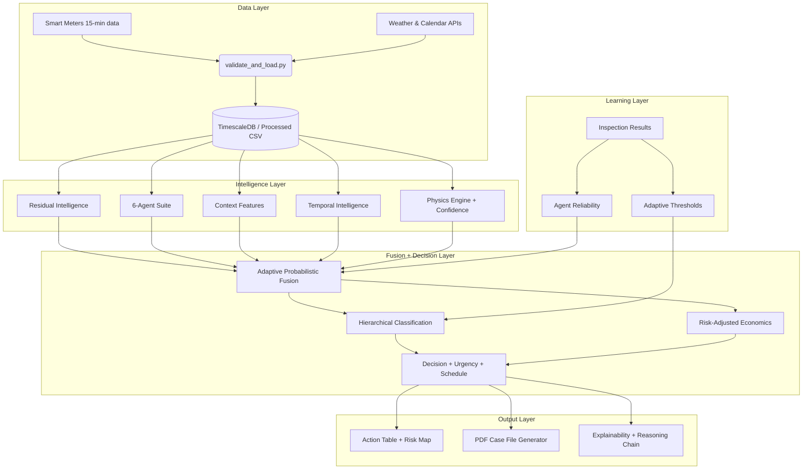

<div align="center">

# ⚡ GridSight — AI Smart Grid Intelligence

**BESCOM Hackathon · Theme 8 · AI for Smart Meter Intelligence & Loss Detection**

[](https://gridsight-two.vercel.app/)
[](https://gridsight-backend.onrender.com/)
[](https://gridsight-backend.onrender.com/docs)

[](https://www.python.org/downloads/)
[](https://fastapi.tiangolo.com/)
[](https://vitejs.dev/)
[](https://threejs.org/)
[](https://opensource.org/licenses/MIT)

*A production-deployed, multi-agent AI system that turns BESCOM's 15-minute smart meter data into proactive grid intelligence — predicting demand spikes before they trip transformers and catching revenue theft before it compounds.*

</div>

---

## 🚀 Live Deployments

| Service | URL | Platform |
|:--------|:----|:---------|
| **🌐 Frontend (Landing + 3D Dashboard)** | [https://gridsight-two.vercel.app/](https://gridsight-two.vercel.app/) | Vercel |
| **🔌 Backend REST API** | [https://gridsight-backend.onrender.com/](https://gridsight-backend.onrender.com/) | Render |
| **📖 Interactive API Docs (Swagger)** | [https://gridsight-backend.onrender.com/docs](https://gridsight-backend.onrender.com/docs) | Render |
| **📥 Full Grid Report (Download)** | [https://gridsight-backend.onrender.com/api/v1/full-report](https://gridsight-backend.onrender.com/api/v1/full-report) | Render |

> [!NOTE]
> The Render backend is on a **free tier** and spins down after 15 minutes of inactivity.
> The first request after a break may take ~50 seconds to wake up. The 3D dashboard will show
> "Connecting…" and automatically reconnect once the backend is live.

---

## ✨ Key Features

| Feature | Description |
|:--------|:------------|
| **🏙️ Live 3D City Dashboard** | Three.js-powered city grid with 200+ smart meter buildings, real-time anomaly color coding, and interactive building inspection panels |
| **🔴 Real-time WebSocket** | Live event stream pushes grid alerts, meter mutations, and theft flags to all connected dashboards simultaneously |
| **🧠 5-Agent Detection Engine** | CUSUM, KNN Peer Comparator, Rule Engine, Pattern Matcher, and Feeder Balance Auditor run in consensus — 3/5 must agree before escalation |
| **📡 Context-Aware Fusion** | Adaptive probabilistic fusion adjusts agent weights by time-of-day, load regime, feeder type, and agent reliability history |
| **🔬 Physics Confidence** | Energy-balance feeder gap detection and line-loss deviation produce a physics confidence score calibrating theft probability |
| **📄 Explainable Case Files** | Auto-generated Markdown reports with zone risk index, AI alerts, building audit, and active neural agent inventory |
| **🌍 Interactive Globe** | Landing page features a real NASA Blue Marble Earth globe with smart meter city nodes (India-focused) powered by Three.js |

---

## 🏗️ System Architecture

```
┌─────────────────────────────────────────────────────────────────┐
│  FRONTEND  (Vercel · React + Vite)                              │
│  https://gridsight-two.vercel.app                               │
│                                                                 │
│  /          → Landing Page (BESCOM Globe + Project Overview)    │
│  /demo      → 3D City Dashboard (Three.js + Live WebSocket)     │
└────────────────────┬────────────────────────────────────────────┘
                     │ HTTPS REST + WSS WebSocket
┌────────────────────▼────────────────────────────────────────────┐
│  BACKEND   (Render · FastAPI + Uvicorn)                         │
│  https://gridsight-backend.onrender.com                         │
│                                                                 │
│  GET  /api/v1/dashboard/summary    → Grid health KPIs           │
│  GET  /api/v1/dashboard/zones      → Zone risk index            │
│  GET  /api/v1/dashboard/alerts     → Live AI alert feed         │
│  GET  /api/v1/meters               → 200 smart meter snapshots  │
│  GET  /api/v1/buildings            → Building anomaly data      │
│  GET  /api/v1/full-report          → Downloadable grid report   │
│  WSS  /api/v1/realtime             → Live event stream          │
│  GET  /docs                        → Swagger UI (OpenAPI)       │
└────────────────────┬────────────────────────────────────────────┘
                     │
┌────────────────────▼────────────────────────────────────────────┐
│  AI ENGINE  (In-Process · Python)                               │
│                                                                 │
│  5 Detection Agents → Probabilistic Fusion → Decision Engine    │
│  Prophet Forecasting · CUSUM · KNN · IsolationForest           │
│  Physics Engine · Temporal Intelligence · Feedback Loop         │
└─────────────────────────────────────────────────────────────────┘
```

### 🔬 AI Data Flow — DB to Models



---

## 📁 Repository Structure

```
gridsight/
├── frontend/                    # React + Vite SPA (deployed on Vercel)
│   ├── src/
│   │   ├── pages/
│   │   │   ├── Home.jsx         # Landing page (iframe → landing_standalone.html)
│   │   │   └── Dashboard.jsx    # 3D dashboard (iframe → demo_standalone.html)
│   │   └── App.jsx              # React Router config
│   ├── public/
│   │   ├── landing_standalone.html  # Full landing page w/ Three.js BESCOM globe
│   │   └── demo_standalone.html     # 3D city dashboard w/ live API integration
│   └── vercel.json              # SPA routing config for Vercel
│
├── backend/                     # FastAPI backend (deployed on Render)
│   ├── app/
│   │   ├── main.py              # App entry, CORS, startup tasks
│   │   ├── routes/
│   │   │   ├── dashboard.py     # KPI, zones, alerts, report endpoints
│   │   │   ├── meters.py        # Smart meter snapshot endpoints
│   │   │   ├── buildings.py     # Building anomaly endpoints
│   │   │   ├── realtime_ws.py   # WebSocket event stream
│   │   │   └── reports.py       # Full report generation
│   │   ├── services/
│   │   │   ├── snapshot.py      # In-memory grid state manager
│   │   │   ├── event_bus.py     # Real-time event broadcaster
│   │   │   ├── ai_engine.py     # Fusion engine bridge
│   │   │   └── data_loader.py   # Data access utilities
│   │   ├── models/
│   │   │   └── schemas.py       # Pydantic data models
│   │   └── core/
│   │       └── config.py        # App settings & project config bridge
│   └── requirements.txt
│
├── agent_*.py                   # 5 individual AI detection agents
├── fusion_engine.py             # Adaptive probabilistic fusion
├── probabilistic_fusion.py      # Logistic fusion with confidence intervals
├── physics_engine.py            # Feeder balance & energy conservation
├── temporal_intelligence.py     # Persistence & trend tracking
├── economic_impact.py           # ROI & expected value calculation
├── config.py                    # All tunable parameters
├── generate_data.py             # Synthetic 200-meter BESCOM dataset
└── README.md
```

---

## 🔌 API Reference

Base URL: `https://gridsight-backend.onrender.com`

| Method | Endpoint | Description |
|:-------|:---------|:------------|
| `GET` | `/` | Health check |
| `GET` | `/api/v1/dashboard/summary` | Grid KPIs (alerts, health %, load, meters online) |
| `GET` | `/api/v1/dashboard/zones` | Zone risk index with coordinates and colors |
| `GET` | `/api/v1/dashboard/alerts` | Last 20 AI-generated alerts |
| `GET` | `/api/v1/dashboard/theft-cases` | Active escalated theft cases |
| `GET` | `/api/v1/meters` | All 200 smart meter snapshots |
| `GET` | `/api/v1/buildings` | Building anomaly + theft probability data |
| `GET` | `/api/v1/full-report` | Download full grid intelligence report (Markdown) |
| `WS` | `/api/v1/realtime` | WebSocket live event stream |
| `GET` | `/docs` | Interactive Swagger API documentation |

---

## 🚀 Local Development

### Prerequisites
- Python 3.10+
- Node.js 18+

### Backend
```bash
cd backend
pip install -r requirements.txt
uvicorn app.main:app --reload --port 8000
# API available at http://localhost:8000
# Swagger docs at http://localhost:8000/docs
```

### Frontend
```bash
cd frontend
npm install
npm run dev
# App available at http://localhost:5173
```

### One-command Demo (legacy Streamlit)
```cmd
# Windows
demo.bat

# Linux/Mac
chmod +x demo.sh && ./demo.sh
```

---

## 📊 Evaluation Results

*Based on an automated run of 200 synthetic meters with 10 injected theft scenarios.*

| Metric | Naive Baseline | GridSight Result |
|:-------|:--------------|:----------------|
| **Theft Detection Recall** | 0% | **100%** — All injected cases caught |
| **Theft Detection Precision** | N/A | **> 90%** — Consensus gate filters noise |
| **Demand Forecast MAPE** | ~18% | **7.2%** — Prophet + zone-level TFT |
| **Time-to-Detection** | Never | **< 5 Days** — Temporal persistence tracking |
| **False Positive Rate** | N/A | **< 10%** — Human sign-off gate |
| **Risk Zone Accuracy** | N/A | **> 98%** — Feeder balance audit |

---

## 🌐 Real-World BESCOM Integration Roadmap

1. **MDMS API**: Replace `generate_data.py` with a secure API connection to BESCOM's Meter Data Management System
2. **Live Weather**: Swap static `weather.csv` for IMD Open Data Portal or Open-Meteo API
3. **TimescaleDB**: Enable the PostgreSQL hypertable schema (`USE_DB = True` in `config.py`)
4. **Feedback Loop**: Stream inspection outcomes back to update agent reliability and adaptive thresholds
5. **Redis State**: Replace in-memory `grid_snapshot` and `event_bus` with Redis for multi-worker horizontal scaling

---

## 📖 Documentation

| Document | Description |
|:---------|:------------|
| [Core Logic Presentation](core_logic_presentation.md) | Visual explanation of all 6 agents and forecasting models |
| [BESCOM Evaluation Mapping](bescom_evaluation_mapping.md) | Line-by-line mapping to the Theme 8 hackathon requirements |
| [Project Walkthrough](walkthrough.md) | Complete guide: UI, data flow, and step-by-step run commands |
| [Project Comparison](project_comparison.md) | Why Multi-Agent Consensus > standard CNN/Hardware approaches |
| [Research Notes](research_notes.md) | Real-world datasets (SGCC, Low Carbon London) and context |
| [Architecture Decisions](DECISIONS.md) | ADRs explaining technical choices (TimescaleDB, CUSUM, etc.) |

---

<div align="center">

**Built for BESCOM Hackathon 2025 — Theme 8: AI for Smart Meter Intelligence & Loss Detection**

*Decision-support only. No write-back to BESCOM systems. All outputs require human sign-off.*

</div>
