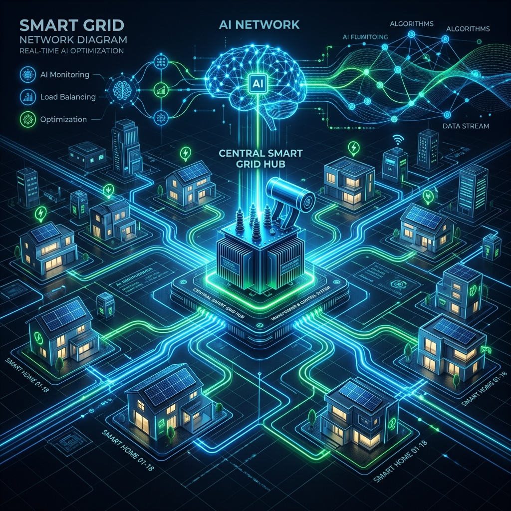

# ⚡ GridSight: Under the Hood



> **The Core Philosophy:** GridSight rejects the "Black Box" deep-learning approach. Real-world power grids require **explainability, physics-informed rules, adaptive fusion, and economic prioritization** to prevent false accusations and grid failures.

---

## 1. The Data Pipeline: Demo vs. Reality

How does data move from a house to our AI? Here is the comparison between our current prototype environment and the target BESCOM production environment.

### 🔄 Data Architecture Flow

```mermaid
graph TD
    subgraph Prototype Demo Data Flow
        A1[generate_data.py] -->|Injects 5 Theft Types| B1(CSV Files)
        B1 --> C1[validate_and_load.py]
        C1 -->|Outputs to| D1[(data/processed/)]
    end

    subgraph Real BESCOM Production Flow
        A2[Smart Meters via Cellular] -->|15-min packets| B2(BESCOM MDMS API)
        B2 --> C2[validate_and_load.py - The Washer]
        C2 -->|SQL INSERT| D2[(TimescaleDB PostgreSQL)]
    end

    D1 & D2 --> E{GridSight AI Engines}
    
    style A1 fill:#1E293B,stroke:#00D1FF
    style A2 fill:#1E293B,stroke:#00FF94
    style D2 fill:#0F172A,stroke:#FF007A,stroke-width:2px
```



> [!TIP]
> **Why TimescaleDB?**
> Standard databases crash when querying millions of smart meters over time. TimescaleDB chunks time-series data into "Hypertables," allowing us to query a 5-year history of a meter in milliseconds. The AI code remains exactly the same; only the storage engine shifts.

---

## 2. The Demand Engine: Forecasting the Future

To prevent transformers from exploding during summer peaks, we use a two-stage forecasting architecture. We don't just guess the average; we calculate the **Worst-Case Scenario**.

### Stage 1: Facebook Prophet (Per-Meter Granularity)
*   **What it is**: An additive regression model built by Facebook, incredibly strong at handling human seasonality (weekends, holidays).
*   **How we use it**: It runs on individual houses to establish a baseline. If a house deviates from its own Prophet baseline, it triggers an anomaly.
*   **The Reason**: It is lightweight and fast enough to run across 10,000 meters independently.

### Stage 2: Temporal Fusion Transformer / TFT (Zone Risk)
*   **What it is**: A state-of-the-art Deep Learning architecture for multi-horizon forecasting. Unlike older models, it outputs **Probabilistic Bands** (P10, P50, P90).
*   **How we use it**: We aggregate the meters to the Transformer level. The TFT looks at the total load and predicts the P90 (Worst Case) line for tomorrow.
*   **The Reason**: BESCOM doesn't care about the "average" load. They care if the *worst-case peak* crosses 100% of the transformer's physical capacity.

---

## 3. The Anomaly Engine: Meet the 6 Detectives

GridSight uses a **Multi-Agent Ensemble**. Instead of one algorithm guessing, 6 distinct agents look for specific signatures. 

### 🕵️ Agent 1: The CUSUM Break Detector
*   **What it looks for**: Sudden, sustained downward shifts in consumption.
*   **How it works**: Uses the Cumulative Sum (CUSUM) statistical quality-control algorithm. It maintains a running sum of deviations from the mean.
*   **The Reason**: When a thief installs a bypass wire, usage drops instantly and stays low. CUSUM detects the exact hour the "break" happened, giving us an "Injection Date" for the case file.

### 🕵️ Agent 2: The Peer Network (KNN)
*   **What it looks for**: A house consuming drastically less than its identical neighbors.
*   **How it works**: Uses K-Nearest Neighbors to find 20 "Social Twins" (houses with the exact same square footage, tariff, and historical curve). 
*   **The Reason**: If a single house drops by 80%, it might be theft. But if *all 20 twins* also drop by 80%, it's a neighborhood power outage or a holiday weekend. This agent kills False Positives.

### 🕵️ Agent 3: The Physics Rule Engine
*   **What it looks for**: Violations of the laws of physics.
*   **How it works**: Hardcoded `if/then` logic. Example: "If kWh = 0.0 but voltage is dropping, someone is bypassing the meter."
*   **The Reason**: Deep learning is stupid. It doesn't know physics. This agent enforces hard physical minimums (like refrigerator standby power) that cannot legally be zero in an occupied home.

### 🕵️ Agent 4: The Signature Pattern Matcher
*   **What it looks for**: Known behavioral tricks used by thieves.
*   **How it works**: Uses Fast Dynamic Time Warping (DTW) to match the meter's curve against a library of known theft shapes (e.g., the "Night Zero" curve where a thief unhooks the meter every night at 10 PM).
*   **The Reason**: Experienced thieves don't steal 24/7; they steal during specific hours. DTW finds shapes even if the timing is slightly shifted.

### 🕵️ Agent 5: The Feeder Balance Auditor
*   **What it looks for**: Energy leaking from the grid itself.
*   **How it works**: Computes: `(Energy from Transformer) - (Sum of all 200 meters below it) - (Normal Heat Loss)`. If the result is positive, energy is missing.
*   **The Reason**: This is the ultimate ground truth. If the transformer pushes 500 kWh, but the meters only report 400 kWh, theft is *mathematically proven* to be happening on that specific wire.

### 🕵️ Agent 6: The Isolation Forest (The Outlier)
*   **What it looks for**: Things we didn't explicitly program it to look for.
*   **How it works**: An unsupervised machine learning model that randomly partitions data until it isolates anomalies. Anomalies take fewer partitions to isolate because they are "far away" from normal clusters.
*   **The Reason**: Thieves invent new methods every day. The Isolation Forest catches bizarre multivariate anomalies that the other 5 rule-based agents might miss.

### 🔍 Residual Intelligence + Context Signals
*   **Residuals** compare actual vs forecast to label sudden drops, periodic zeros, or gradual drift.
*   **Context features** (time of day, load regime, feeder type) adapt agent influence to real-world conditions.
*   **Temporal intelligence** tracks persistence and trend to separate transient dips from sustained anomalies.

### ⚡ Physics Confidence
*   Energy-balance consistency and loss deviation produce a **physics confidence score** used to calibrate $P(\text{theft})$.

---

## 4. The Consensus Gate (Why it works)

If you have 6 agents, how do you make a final decision? We use an adaptive probabilistic fusion engine.

```mermaid
flowchart TD
    A[Meter 042 Data] --> C(CUSUM)
    A --> P(Peer KNN)
    A --> R(Rules)
    A --> S(Signature)
    A --> F(Feeder Balance)
    A --> I(Isolation Forest)
    A --> X(Residual Intelligence)
    A --> Y(Context + Temporal)
    A --> Z(Physics Confidence)

    C & P & R & S & F & I & X & Y & Z --> W{Adaptive Probabilistic Fusion}
    W --> Alert[P(theft) + CI + Uncertainty]
    Alert --> Decision[Hierarchical Decision + Expected Value]
    
    style Alert fill:#0EA5A4,stroke:#0F172A,color:#FFF
    style Decision fill:#9F1239,stroke:#E11D48,color:#FFF
```

> [!IMPORTANT]
> **The Secret Sauce:** We **adaptively weight** agent signals with context and reliability, then calibrate using physics confidence. In the diagram above, even though CUSUM and Rules fired, the Peer Agent and physics confidence dampen the probability when the anomaly is likely a normal event (e.g., vacation scenario).
